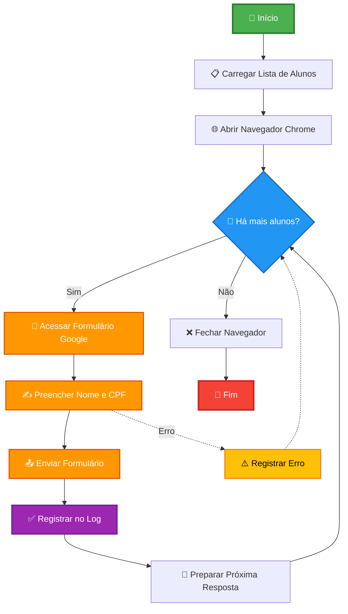

# 🤖 Automação de Formulário Google Forms com Selenium

Projeto de automação para preenchimento em massa de formulários do Google Forms utilizando Python e Selenium WebDriver.

## 📋 Índice

- [Sobre o Projeto](#sobre-o-projeto)
- [Fluxograma](#fluxograma)
- [Funcionalidades](#funcionalidades)
- [Tecnologias Utilizadas](#tecnologias-utilizadas)
- [Pré-requisitos](#pré-requisitos)
- [Instalação](#instalação)
- [Como Usar](#como-usar)
- [Estrutura do Projeto](#estrutura-do-projeto)
- [Log de Execução](#log-de-execução)

## 🎯 Sobre o Projeto

Este script automatiza o preenchimento de formulários do Google Forms com dados de múltiplos alunos, registrando todas as operações em arquivo de log para auditoria e controle.

## 📊 Fluxograma



## ✨ Funcionalidades

- ✅ Preenchimento automático de campos (Nome e CPF)
- ✅ Envio automático de múltiplos formulários
- ✅ Sistema de log completo (INFO, ERROR, WARNING)
- ✅ Tratamento de exceções robusto
- ✅ Navegador maximizado automaticamente
- ✅ Suporte a múltiplas respostas sequenciais

## 🛠 Tecnologias Utilizadas

- **Python 3.14.0
- **Selenium 4.38.0 - Automação web
- **WebDriver Manager 4.0.2 - Gerenciamento automático de drivers
- **ChromeDriver** - Driver do Google Chrome
- **Logging** - Registro de operações

## 📦 Pré-requisitos

- Python 3.7 ou superior
- Google Chrome instalado
- Conexão com a internet

## 🚀 Instalação

### 1. Clone o repositório

```bash
git clone https://github.com/filipecrodrigues/selenium-form-automation.git
cd selenium-form-automation
```

### 2. Crie o ambiente virtual

```bash
python -m venv .venv
```

### 3. Ative o ambiente virtual

**Windows (PowerShell):**
```powershell
.\.venv\Scripts\Activate.ps1
```

**Windows (CMD):**
```cmd
.venv\Scripts\activate.bat
```

**Linux/Mac:**
```bash
source .venv/bin/activate
```

### 4. Instale as dependências

```bash
pip install selenium webdriver-manager
```

## 💻 Como Usar

### 1. Configure os dados dos alunos

Edite a lista `alunos` no arquivo `preenchimento_formulario.py`:

```python
alunos = [
    {"nome": "Ana Paula Souza", "cpf": "123.456.789-00"},
    {"nome": "Bruno Lima Costa", "cpf": "234.567.890-11"},
    {"nome": "Carla Mendes Silva", "cpf": "345.678.901-22"},
]
```

### 2. Execute o script

```bash
python preenchimento_formulario.py
```

### 3. Acompanhe a execução

O script irá:
- Abrir o Chrome automaticamente
- Preencher os formulários sequencialmente
- Exibir mensagens no terminal
- Gerar o arquivo `log_envios.txt`

## 📁 Estrutura do Projeto

```
selenium-form-automation/
│
├── .venv/                      # Ambiente virtual (não versionado)
├── preenchimento_formulario.py # Script principal
├── log_envios.txt             # Arquivo de log (gerado automaticamente)
├── README.md                  # Documentação
└── requirements.txt           # Dependências do projeto
```

## 📄 Log de Execução

O arquivo `log_envios.txt` registra:

- ✅ **INFO**: Formulários enviados com sucesso
- ⚠️ **WARNING**: Avisos (ex: botão não encontrado)
- ❌ **ERROR**: Erros durante o preenchimento

**Exemplo de log:**

```
2025-10-29 14:30:15 - INFO - Dados preenchidos para: Ana Paula Souza
2025-10-29 14:30:18 - INFO - Formulário enviado para: Ana Paula Souza - 123.456.789-00
2025-10-29 14:30:25 - ERROR - Erro: campos não encontrados para Bruno Lima Costa - 234.567.890-11
```

## ⚙️ Configurações Avançadas

### Executar em modo headless (sem interface gráfica)

```python
options = webdriver.ChromeOptions()
options.add_argument("--headless")
options.add_argument("--disable-gpu")
```

### Ajustar tempos de espera

```python
time.sleep(2)  # Ajuste conforme necessidade
```

## 🤝 Contribuindo

Contribuições são bem-vindas! Sinta-se à vontade para:

1. Fazer um fork do projeto
2. Criar uma branch para sua feature (`git checkout -b feature/NovaFuncionalidade`)
3. Commit suas mudanças (`git commit -m 'Adiciona nova funcionalidade'`)
4. Push para a branch (`git push origin feature/NovaFuncionalidade`)
5. Abrir um Pull Request

## 📄 Licença

Este projeto é de código aberto para fins educacionais.

## 👨‍💻 Autor

**Filipe**

- GitHub: [filipecrodrigues](https://github.com/filipecrodrigues)
